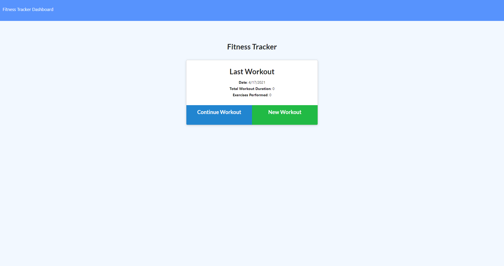
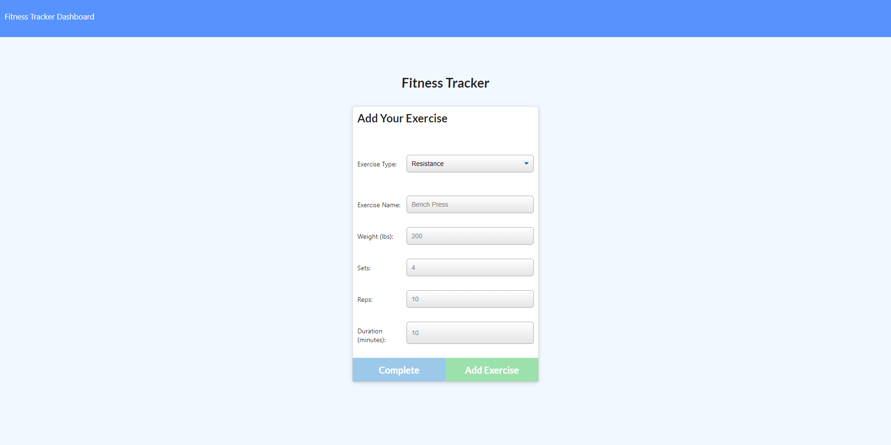
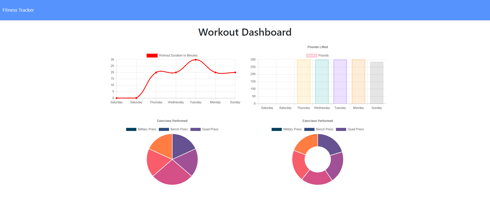

# Workout_Tracker_NP

## Description 

This is an app that will allow you to track your workouts and see graphs displaying your workouts as you go. It's a simple app that allows user to name their workout what they were doing and store it all in the database. This is to show my abilities working with mongodb.

## Table of Contents

  * [Installation](#installation)
  * [Usage](#usage)
  * [Contributing](#contributing)
  * [Questions](#questions)
  * [Links](#links)

## Installation

  npm install
  npm seeders/seed
  npm start

## Usage

  You can add workout or continue a workout. You can view the dashboard showing the stats for the workout, and it shows your last workout on the main page.

## Contributing

## Questions

  How to reach me?
  GitHub: https://github.com/undefined
  Email: Nickpodski@gmail.com

## Links

https://github.com/Nickpodski/Workout_Tracker_NP - Github

https://gentle-chamber-10770.herokuapp.com/ - Heroku Link!

  